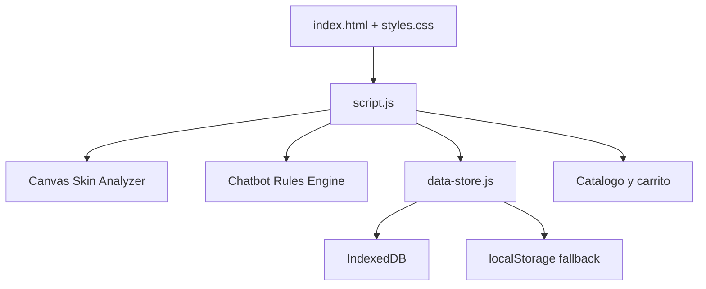

# Arquitectura MAKAKAO

## Resumen

MAKAKAO es una aplicacion web estatica orientada a skincare personalizado con cacao ecuatoriano. La experiencia combina:

- Scanner facial en navegador con camara, carga de foto y analisis local de pixeles.
- Recomendaciones de rutina segun metricas estimadas de piel.
- Laboratorio de formulas personalizadas.
- Tienda demo con carrito.
- Chatbot de soporte sobre productos, piel y reacciones.
- Persistencia local mediante IndexedDB con fallback a localStorage.

## Capas del proyecto

## Frontend

- `index.html`: estructura de secciones, scanner, laboratorio, tienda, chat, carrito e historial.
- `styles.css`: sistema visual responsive, componentes de scanner, cards, historial y tienda.
- `script.js`: comportamiento principal de la aplicacion.
- `data-store.js`: capa de persistencia local.
- `assets/products/hero-products.webp`: imagen optimizada del home.

## Scanner facial

El scanner funciona sin backend:

1. El usuario activa camara o sube una foto.
2. La imagen se dibuja en un canvas de 320 x 320.
3. Se analiza una region central de la imagen.
4. Se calculan metricas aproximadas:
   - hidratacion estimada
   - sensibilidad visual
   - balance
   - poros visibles
   - textura
   - brillo
   - uniformidad
5. Se detecta un tipo de piel probable: seca, grasa, mixta o sensible.
6. Se guarda el resultado en IndexedDB.

Limitacion: este analisis es un MVP visual local. No reemplaza diagnostico dermatologico ni un modelo entrenado con datos clinicos.

## Chatbot

El chatbot actual es un motor de reglas contextual:

- Responde sobre productos, piel sensible, poros, textura, brillo, hidratacion y posibles reacciones.
- Usa el ultimo resultado del scanner como contexto.
- Guarda preguntas y respuestas en la base local.

Para un chatbot con IA generativa real, se recomienda conectar un backend serverless con una API de modelo, evitando exponer claves en GitHub Pages.

## Base de datos

La app usa IndexedDB como base de datos funcional en navegador.

Stores:

- `scans`: resultados de scanner.
- `chat`: preguntas y respuestas.
- `cart`: estado del carrito.
- `formulas`: formulas guardadas.
- `activity`: historial visible de acciones.

## Base de datos remota recomendada

GitHub Pages no ejecuta backend. Para una base remota real se recomienda:

- Firebase Firestore: buena opcion para prototipos frontend.
- Supabase: buena opcion si se quiere SQL/Postgres, autenticacion y dashboard.

La integracion debe hacerse con reglas de seguridad y variables publicas controladas. Nunca se debe publicar una clave secreta en el repositorio.

## Despliegue

El proyecto es estatico y puede desplegarse desde la raiz del repositorio en GitHub Pages. Ver `docs/GITHUB_PAGES_DEPLOY.md`.
